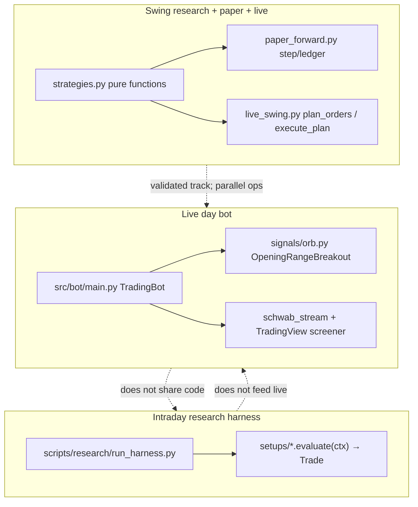
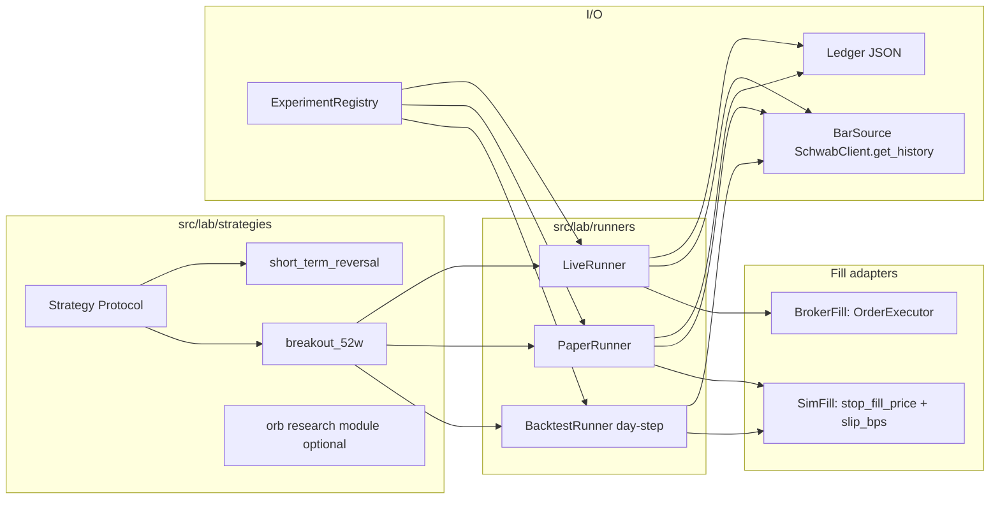
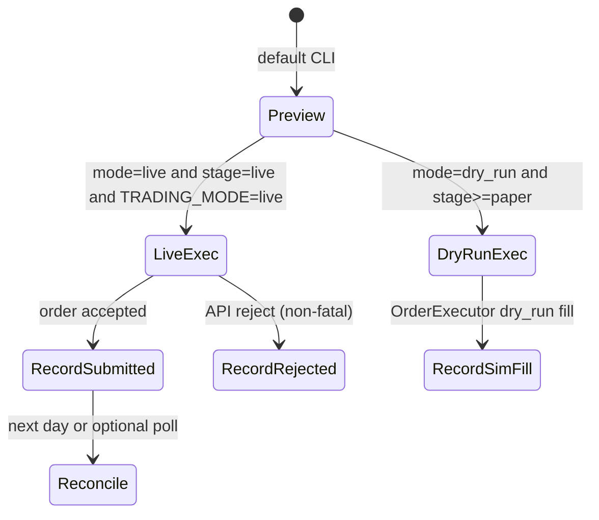
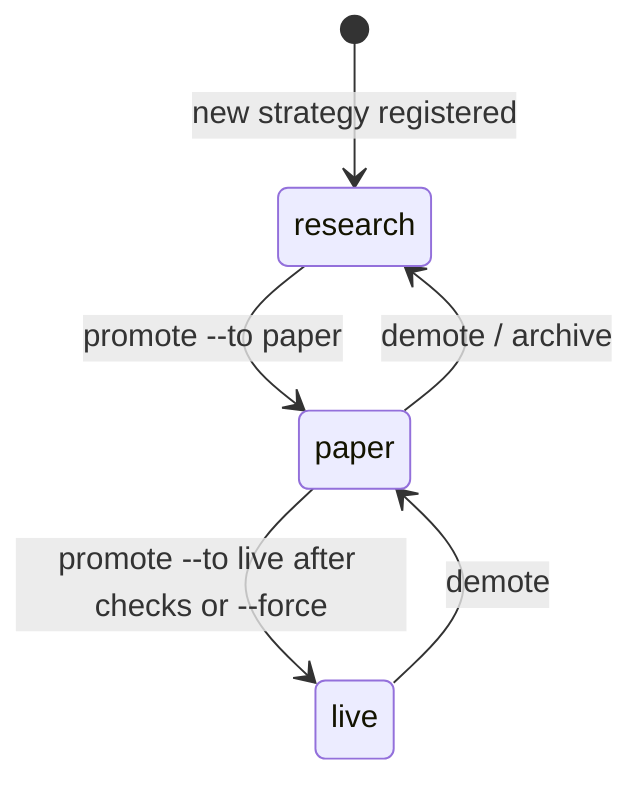
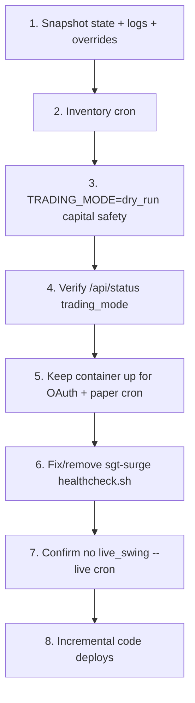

# Trading Lab v1 — Cleanup + Experiment Platform

| Field | Value |
| --- | --- |
| **Author** | TBD |
| **Date** | 2026-07-22 |
| **Branch** | `cleaning` |
| **Status** | Approved (rev 4) — **implemented on `cleaning`** (Safety→Productize) |
| **Workspace** | `/Users/jacobmadsen/Projects/Trading/sgt-schwab` |
| **Deploy host** | `jacisjake@ut.gitsum.rest` → `/opt/sgt-schwab/` |

---

## Overview

This repository has accreted three parallel stacks: a live day bot hardcoded to Opening Range Breakout (`src/bot/main.py` ~1171 lines), an intraday research harness with a different setup interface (`scripts/research/setups/*`), and a swing research + paper + live path built around pure strategy functions (`scripts/research/swing/*`, `scripts/live_swing.py`). The three paths do not share a strategy contract, so validated edges cannot move cleanly from backtest → paper → real money.

**Trading Lab v1** turns the project into a maintainable experiment platform: one Strategy Protocol, an experiment registry, an enforced promotion gate (backtest → paper forward → live), and a deliberate delete/archive of research dead-ends and deploy leftovers. Lab success is measured by experiment throughput and honest equity curves — not by shipping a “+1%/day bot.”

---

## Background & Motivation

### Current state (three stacks)



| Stack | Entry points | Interface | Feeds live? |
| --- | --- | --- | --- |
| Live day (ORB) | `scripts/run_bot.py` → `TradingBot` | `SignalGenerator.generate()` | Yes (container CMD) |
| Intraday research | `scripts/research/run_harness.py` | `Setup.evaluate(ctx) → Trade` | No |
| Swing | `run_swing.py`, `run_portfolio.py`, `paper_forward.py`, `live_swing.py` | Pure functions + dated trade dicts | Paper yes; live gated by `--live` |

### Reality check (must not be lost in marketing language)

| Claim / fact | Status |
| --- | --- |
| North-star ambition ~1% account increase per day | Aspirational only. **Not** a claim any current edge delivers. |
| +1%/day compounded | Extreme (~12×/year if sustained). Treat as growth **goal**, not design assumption. |
| `breakout_52w` backtest | ~+55% over ~2 years, maxDD ~10% (bake-off 2026-06-11 / update 2026-06-12) via `breakout_52w_trades` + `simulate_portfolio` |
| `short_term_reversal` | ~+0.47%/trade, PF 1.38; validated lower-return fallback |
| Live ORB | Idle since ~2026-06-04; flat ~$199 cash; last real signal stale |
| Paper `breakout_52w` | Underwater ~−4.2% vs $200 start as of early July 2026 (~$191.6, 8 open positions, last stepped 2026-07-02) |
| Cash account T+1 | ~1 full deploy/day for day trades; swing multi-hold is the practical multi-position path |
| Promotion rule (existing) | **Do not promote to live until forward paper proves out** |

**Lab job:** maximize honest experiment throughput (backtest → paper ledger → optional live) and clean equity measurement. The lab does **not** “code the 1% bot.”

### Pain points

1. **Hardcoded strategy** — `TradingBot.__init__` fixes `OpeningRangeBreakout` (`src/bot/main.py:112`); swapping strategies requires editing the god object.
2. **Divergent contracts** — `SignalGenerator` (live), `Setup.evaluate` (intraday research), pure functions + `plan_orders` (swing) cannot be promoted without rewrites.
3. **Cruft load** — dead backtests (`backtest_hmm`, `backtest_surge`, …), sgt-surge deploy remnants, empty dirs, tastytrade/alpaca/regime pycache ghosts, press-release scheduler hooks with no scanner module, unused deps (`streamlit`, `sqlalchemy`, `plotly` only via `regime_terminal`).
4. **Ops ambiguity** — container still runs full ORB bot (`Dockerfile` CMD `scripts/run_bot.py`) while the validated track is daily paper cron; live capital sits idle under a retired primary strategy. Host `scripts/healthcheck.sh` still targets **sgt-surge** container names (broken).
5. **Duplicated breakout logic + fill divergence** — `is_fresh_breakout` / sizing in `paper_forward.py` vs near-copy in `live_swing.plan_orders`; paper uses `stop_fill_price` + slip; live prices stops at close and has no slip model.

### What already works (do not rewrite)

- Schwab OAuth + token auto-refresh: `src/core/schwab_client.py`, `schwab_stream.py`, `schwab_token.py`; token at `state/schwab_token.json`
- Dry-run / live order path: `src/core/order_executor.py` + `config.settings.TradingMode` (`dry_run` | `live`). Verified: dry_run short-circuits to `_dry_run_fill` and never hits the broker.
- Risk primitives: `position_sizer` (fixed fractional), `portfolio_limits`, `stop_manager`, `stop_fill_price` in `strategies.py`
- Swing pure strategies + portfolio sim + metrics: `scripts/research/swing/strategies.py`, `portfolio.py`, `metrics.py` / `sim.py`, `src/bot/comparison.py`
- Paper forward ledger: `paper_forward.step` / `run_once`, cron via `run_paper_forward.sh`; catch-up via `paper_catchup.py`
- Live swing two-phase design: pure `plan_orders` then `execute_plan` (`scripts/live_swing.py`); rejections non-fatal; email always on results
- Ops: `deploy/deploy-remote.sh` (rsync excludes `state/` and `.env`), `podman-compose.yml`, `run_token_watch.sh`, FastAPI dashboard (`src/bot/web.py`)
- Unit tests under `tests/unit/` including full swing paper suite and `test_live_swing.py`
- Float enrichment still used by momentum scanner path: `src/bot/float_provider.py` (not dead code)

**Not lab foundation (fix or delete, do not “KEEP” as-is):** `scripts/healthcheck.sh` (sgt-surge leftovers).

---

## Goals & Non-Goals

### Goals

1. **Single Strategy Protocol** used by backtest, paper, and live (same **decision** code path; fill adapters differ and are documented).
2. **Experiment registry** — named experiments with params, capital, mode, stage, ledger path, gate config.
3. **Enforced promotion gate** — hard stage/mode checks + soft advisory metrics; live requires explicit promote (or logged `--force`).
4. **Module layout** for lab v1: swing experiment core under `src/lab/`; research CLIs thin; live day bot capital-disabled by default.
5. **Explicit delete/archive list** with co-delete of tests and all hard-coded ledger consumers.
6. **Server cutover plan** for `ut.gitsum.rest` — stop idle ORB live money first; keep token + paper.
7. **Incremental PR plan** — mergeable slices; safety before refactor; dual-run for paper shim.
8. **Risk / progress metrics** oriented to daily equity growth toward the 1%/day north star (measurement only).

### Non-goals (explicitly out of lab v1)

| Out of scope | Rationale |
| --- | --- |
| Alpaca / `runner_momentum` implementation | Spec only (`docs/superpowers/specs/2026-07-01-runner-momentum-backtest-design.md`); do not build |
| Multi-broker abstraction | Schwab only via schwab-py |
| Options / futures / shorting | Cash long equities only |
| Unifying full intraday stream bot with swing under one process | v1 daily `ExperimentRunner` first; intraday later |
| Guaranteeing +1%/day returns | Measurement target, not product promise |
| Kelly sizing as production path | Demote / leave unused unless a future experiment opts in |
| Streaming redesign, new dashboard product, multi-tenant lab | Keep existing web + email alerts |
| Rewriting Schwab OAuth / token lifecycle | Preserve working auth |
| Mark-to-market equity as promotion SoT | v1 gates use **realized** equity (bias accepted; MTM is v1.1) |

---

## Proposed Design

### Design principles

1. **Pure strategy decisions first** — extract one decision module shared by paper and live before growing registry surface.
2. **Plan then execute** — keep `live_swing`’s pure plan / impure execute split as the live template.
3. **Runner owns capital constraints** — strategy emits signals/sizing *hints*; runner applies cash, max_concurrent, T+1 caps.
4. **One ledger schema per experiment** — JSON under `state/experiments/<id>/`; paper and live ledgers never share files.
5. **Promotion is data, not convention** — registry stage + hard runtime checks; soft metrics need `--force` to override.
6. **Fill model is explicit** — paper/backtest use sim fills; live uses broker as open-set SoT + audit ledger.
7. **Incremental cleanup** — ops safety before code; shims before path moves; archive/delete with paired tests.

### Target architecture



### 1. Single Strategy Protocol

Unify **decisions** around observations → intents. Simulation, paper cash, and broker fills live in runners/adapters.

```python
# src/lab/protocol.py (new)
from __future__ import annotations
from dataclasses import dataclass, field
from datetime import date
from enum import Enum
from typing import Any, Optional, Protocol, runtime_checkable
import pandas as pd


class Side(str, Enum):
    BUY = "buy"
    SELL = "sell"


@dataclass(frozen=True)
class OrderIntent:
    """Strategy decision — never a broker call.

    Sizing contract (v1 — locked):
      - Exits (SELL): strategy MUST set qty (or notional for paper-only) equal to
        the full open position being closed. Runner does not re-size exits.
      - Entries (BUY): strategy sets risk_pct (required) and stop_price (required
        for risk-based size). Strategy MUST NOT set final cash-capped notional;
        runner computes:
          raw = risk_pct * equity / stop_distance_frac
          notional = min(raw, available_cash)
          skip if notional < min_notional or max_concurrent hit
        Optional strategy notional/qty is treated as an upper hint only (runner
        still applies cash/max_concurrent).
    """
    symbol: str
    side: Side
    reason: str
    stop_price: Optional[float] = None
    target_price: Optional[float] = None
    risk_pct: Optional[float] = None
    qty: Optional[float] = None
    notional: Optional[float] = None  # paper exit convenience; live exits use qty
    metadata: dict = field(default_factory=dict)


@dataclass
class PositionView:
    """Normalized open position seen by Strategy.plan.

    Always present after adapter conversion:
      symbol, qty, avg_entry_price, entry_date, stop_price
    Paper may derive qty = notional / avg_entry_price when only notional is stored.
    """
    symbol: str
    qty: float
    avg_entry_price: float
    entry_date: date
    stop_price: Optional[float] = None
    notional: Optional[float] = None  # paper ledger native field; optional mirror
    metadata: dict = field(default_factory=dict)
    # metadata reserved keys (STR and future multi-day holds):
    #   target_price: float
    #   hold_bars: int          # max hold from params (e.g. 5)
    #   strategy: str
    # Do NOT store mutable bars_held — compute sessions_after_entry from
    # entry_date + market bars (see §1.3).


@dataclass
class PortfolioView:
    as_of: date
    equity: float                 # see Fill model / equity basis per mode
    available_cash: float
    positions: list[PositionView]


@dataclass
class MarketContext:
    """Bars + optional cross-asset series (e.g. SPY for regime).

    Bar window rules (from paper_forward.run_once):
      - fetch_start = as_of - timedelta(days=(lookback + 30) * 2)
      - each symbol needs index position i for as_of with i >= lookback for entries
      - OHLCV columns: open, high, low, close, volume (volume optional for breakout)
      - DatetimeIndex; compare via ts.date() == as_of (session calendar = bar dates)
      - extras["SPY"] required when params.use_regime_gate; missing/empty => risk_on=False
      - MarketContext.now is always date (session date), never wall-clock datetime
    """
    bars_by_symbol: dict[str, pd.DataFrame]
    extras: dict[str, pd.DataFrame] = field(default_factory=dict)
    now: date = field(default_factory=date.today)


@runtime_checkable
class Strategy(Protocol):
    name: str

    def plan(
        self,
        portfolio: PortfolioView,
        market: MarketContext,
        params: dict[str, Any],
    ) -> list[OrderIntent]:
        """Pure: no I/O, no broker. Prefer exits before entries in returned list.

        Runner STILL enforces: process all SELL intents before BUY intents
        regardless of list order (defense in depth against buggy strategies).
        Risk-off gates live inside strategy (or shared helper) and must only
        suppress BUY, never SELL.
        """
        ...
```

#### 1.1 Field dictionary: paper ↔ PositionView ↔ broker

| Concept | Paper ledger (`open_positions[]`) | `PositionView` | Broker / live (`client.get_positions()`) |
| --- | --- | --- | --- |
| Symbol | `symbol` | `symbol` | `symbol` |
| Entry price | `entry_price` | `avg_entry_price` | `avg_entry_price` |
| Size | `notional` ($); no qty | `qty` + optional `notional` | `qty` |
| Stop | `stop_price` | `stop_price` | recomputed as `avg_entry_price * (1 - stop_pct)` if missing (today’s live_swing) |
| Entry date | `entry_date` (ISO str) | `entry_date` (date) | often missing → use ledger audit or `metadata` / assume today only for new |
| Target / hold | not stored for breakout | `metadata.target_price`, `metadata.hold_bars` only; hold **progress** is computed as `sessions_after_entry` (not stored) | not on broker — lab audit ledger only |

**Paper → PositionView** (adapter in runner):

```python
qty = pos["notional"] / pos["entry_price"]  # if entry_price > 0
PositionView(
    symbol=pos["symbol"],
    qty=qty,
    avg_entry_price=pos["entry_price"],
    entry_date=date.fromisoformat(pos["entry_date"]),
    stop_price=pos.get("stop_price"),
    notional=pos["notional"],
    metadata=pos.get("metadata") or {},
)
```

**Broker → PositionView** (live):

```python
PositionView(
    symbol=p["symbol"],
    qty=float(p["qty"]),
    avg_entry_price=float(p["avg_entry_price"]),
    entry_date=audit_entry_date_or_as_of,  # from live audit ledger if known
    stop_price=float(p["avg_entry_price"]) * (1 - stop_pct),  # breakout default
    notional=float(p["qty"]) * float(p["avg_entry_price"]),
    metadata=audit_metadata.get(p["symbol"], {}),
)
```

Live breakout today does not persist stop on the broker; it recomputes from `stop_pct`. Lab v1 keeps that for breakout. STR must store `target_price` / `hold_bars` in the **live audit ledger** metadata at entry time (broker cannot hold them).

#### 1.2 Sizing contract (locked)

| Party | Responsibility |
| --- | --- |
| Strategy | Emit BUY with `risk_pct` + `stop_price` (and reason); emit SELL for full position with `qty` |
| Runner | `equity` / `available_cash` from mode; `notional = min(risk_pct * equity / stop_frac, cash)`; `max_concurrent`; `min_notional` (default $1); decrement cash as entries accepted in-loop |
| Fill adapter | Convert notional → qty at fill price; paper stores notional; live submits qty |

This matches paper `step` and live `plan_orders` formula: `notional = min(risk_pct * equity / stop_pct, cash)`.

**Strategy-side sizing in breakout v1:** `Breakout52wStrategy.plan` may compute the same formula for convenience in unit tests, but the runner **re-applies** caps so cash never goes negative even if strategy is wrong.

#### 1.3 short_term_reversal state machine

Params (locked working config from bake-off): `down_days=3`, `hold=5`, `stop_pct=0.05`, `target_pct=0.10`, `ma=200`, `risk_pct=0.01`, `slip_bps=15`.

Pinned to `short_term_reversal_trades` in `scripts/research/swing/strategies.py`:

```python
# Research reference (do not re-invent):
for j in range(i + 1, min(i + 1 + hold, n)):   # bars AFTER entry only
    if lows[j] <= stop_level: ...               # stop first
    if highs[j] >= target_level: ...            # then target
if exit_price is None:
    exit_j = min(i + hold, n - 1)               # time exit at close of bar i+hold
    exit_price = closes[exit_j]
```

**Entry (BUY)** on session `as_of` at bar index `i` when portfolio does not already hold symbol (v1 **non-overlap per symbol** — research trade-list may overlap; lab paper/live cannot):

1. `close[i] > SMA(close, ma)[i]`
2. last `down_days` closes strictly decreasing

Enter at **raw** close (SimFill stores raw; see §2). Persist on position: `stop_price = entry*(1-stop_pct)`, `metadata.target_price = entry*(1+target_pct)`, `metadata.hold_bars = hold`. **No** `bars_held` counter.

**`sessions_after_entry` (pure, computed in `plan` — never mutated metadata):**

```text
sessions_after_entry(as_of, entry_date, symbol_bars) =
  count of rows in symbol_bars whose ts.date() is in (entry_date, as_of]
  i.e. strictly after entry_date, including as_of
```

- **Entry day** (`as_of == entry_date`): `sessions_after_entry == 0` → emit **no** exit intents (research does not evaluate stop/target/time on bar `i`).
- Matches loop start at `j = i + 1`.

**Exit (SELL)** when `sessions_after_entry >= 1`, priority (same order as research):

1. If `low[as_of] <= stop_price` → reason `stop` (SimFill: `stop_fill_price`)
2. Elif `high[as_of] >= target_price` → reason `target` (SimFill exit level = target)
3. Elif `sessions_after_entry >= hold` → reason `time` at **close**  
   (for `hold=5`, first eligible time-exit session is the 5th trading day **after** entry = research bar `i+hold`)
4. Else hold (no intent)

Do **not** increment a counter before/after checks; recompute from dates + bar calendar every `plan` call so catch-up/replay stays pure.

**Golden fixture (PR10) — split assertions (do not cross-compare engines):**

1. **Decisions vs research** (`short_term_reversal_trades` on the same OHLCV frame): same `entry_date`, `exit_date`, and exit reason path (stop before target before time). Example: stop never hits, target never hits → time exit on session `hold` after entry (research bar `i+hold`).
2. **Fills vs SimFill only** (§2.1 / `paper_forward.step` ratio): given that trade’s raw `entry_price`, raw `exit_price`, and chosen `notional`,  
   `pnl` must match  
   `notional * ((exit_price * (1 - slip)) / (entry_price * (1 + slip)) - 1)`  
   with `slip = 2 * slip_bps / 10_000` within **$0.01**.  
   **Do not** assert `pnl ≈ return_pct * notional` where `return_pct` comes from the trade-list form `exit/entry - 1 - slip` — that is a different formula and will diverge (e.g. entry=100, exit=110, slip=0.003 → ~9.7% vs ~9.34%).

**v1 portfolio rule:** max one open position per symbol; optional `max_concurrent` across symbols (default None = cash-limited only).

#### 1.4 Runner enforcement (defense in depth)

Regardless of strategy list order:

1. Partition intents into SELL then BUY.
2. Apply SELLs first (free cash / clear symbols).
3. Apply BUYs with cash and max_concurrent.
4. Ignore BUY for symbol already held or already selling today.
5. Never drop SELL because of regime/risk-off (strategy must not emit that; runner does not filter sells by regime).

#### 1.5 Golden-test plan (implementation acceptance for PR5)

| Fixture source | Assertion |
| --- | --- |
| `tests/unit/research/swing/test_paper_forward.py` cases for `is_fresh_breakout`, stop exit, trend_break, risk_off entries skipped, exits still fire | `Breakout52wStrategy.plan` + paper adapter produces same symbols/reasons as current `step` decision points |
| `tests/unit/test_live_swing.py` (`test_fresh_breakout_entry_when_risk_on`, `test_no_entry_when_risk_off`, `test_exit_on_stop`, `test_exits_run_even_when_risk_off`, fractional size) | Same plan intents (side, symbol, reason); size within 1e-6 of current formula after runner sizing |
| Shared synthetic DataFrames | One module `tests/unit/lab/fixtures/breakout_bars.py` imported by both old and new tests during migration |

**Parity target:** decision equality (symbol, side, reason, stop level). Fill prices may still differ live vs paper (see Fill model) — tests split **decision tests** vs **fill tests**.

### 2. Fill model v1

Unifying `Strategy.plan` alone does **not** make equity curves identical. Lab v1 locks SimFill to **byte-compatible behavior with `paper_forward.step`** — not a rewritten “apply slip to the stored price” model.

#### 2.1 SimFill — pin to `paper_forward.step` (source of truth)

Reference: `scripts/research/swing/paper_forward.py` `step()` (and helpers it calls). Implementers **copy these formulas**; do not invent one-way leg multipliers on stored prices.

```python
# Exact slip scalar used by step (round-trip haircut as a single factor pair):
slip = 2 * slip_bps / 10_000   # default slip_bps=15 → slip=0.003

# Sizing equity (open MTM ignored):
equity = state["starting_equity"] + state["realized_pnl"]

# ENTRY (breakout / any long entry under SimFill):
entry_price = closes[i]                    # RAW close — NOT close*(1+slip)
notional = min(risk_pct * equity / stop_pct, state["available_cash"])
if notional < 1.0: skip
stop_price = entry_price * (1 - stop_pct)
# append open_positions with entry_price, stop_price, notional, entry_date
state["available_cash"] -= notional

# EXIT price selection (before PnL):
if lows[i] <= stop_price:
    exit_price = stop_fill_price(stop_price, opens[i])  # min(stop, open)
    reason = "stop"
elif trend_break:  # close < SMA(ma_exit), SMA not NaN
    exit_price = closes[i]
    reason = "trend_break"
# STR also: target → exit_price = target_level; time → exit_price = closes[i]

# EXIT PnL + cash (exact):
pnl = notional * ((exit_price * (1 - slip)) / (entry_price * (1 + slip)) - 1)
state["realized_pnl"] += pnl
state["available_cash"] += notional + pnl
# closed_trades store RAW entry_price, RAW exit_price, pnl, reason — not slipped marks
```

| Field | Stored / used value |
| --- | --- |
| `open_positions[].entry_price` | Raw bar close at entry |
| `open_positions[].stop_price` | `entry_price * (1 - stop_pct)` |
| `open_positions[].notional` | Cash reserved (pre-slip) |
| `closed_trades[].exit_price` | Raw `stop_fill_price` or raw close/target |
| `closed_trades[].pnl` | Formula above with `slip = 2 * slip_bps/10_000` |
| Slippage effect | **Only** inside the PnL ratio `(1-slip)/(1+slip)`, never by rewriting stored entry/exit |

**Not SimFill:** trade-list research returns `ret = exit/entry - 1 - slip` with the same `slip = 2 * slip_bps/10_000` (`strategies.py`). That path remains research-only (`*_trades` + `simulate_portfolio`). Lab paper/backtest **must not** use that return form for the day-step ledger.

**Dual-run acceptance (PR6/PR7):** on shared fixtures, new SimFill vs old `step` must match `closed_trades[].pnl`, `available_cash`, `realized_pnl`, and open `notional`s within **$0.01** (and identical symbols/reasons/dates).

#### 2.2 BrokerFill (live) — separate path

| Event | Live (BrokerFill) |
| --- | --- |
| Entry / exit | Market orders via `OrderExecutor`; record submit/reject; fill when available |
| Stop intent | reason=`stop`; plan price advisory only (today’s live_swing uses close as advisory) |
| Slippage | Not modeled in plan; realized via broker |
| Equity basis for sizing | Broker `equity` + `buying_power` as cash |
| Open-set for next plan | **Broker positions** (lab live ledger = audit + scoreboard only) |

**Known live vs paper gap (accepted):** live stop fills ≠ `stop_fill_price`; no mandatory 15 bps haircut; live equity includes MTM. Promotion metrics use SimFill paper ledgers only.

**Implementation order:** pure decisions first, then SimFill (= `step` formulas), then BrokerFill — never three partial decision copies.

### 3. LiveRunner execution + ledger reconciliation



#### 3.1 Modes

| Runner mode | Constructs OrderExecutor? | Places real orders? | Open-set SoT | Lab ledger role |
| --- | --- | --- | --- | --- |
| **paper** | **No** (must not import-execute) | No | Paper ledger | Primary equity SoT |
| **dry_run** | Yes, `TradingMode.DRY_RUN` | No (fabricated fills) | Lab dry_run ledger | Primary; broker untouched |
| **live** | Yes, `TradingMode.LIVE`, `allow_fractional=True` for swing | Yes | **Broker positions** | Audit trail + daily snapshots; not open-set SoT |
| **preview** | No | No | N/A | Prints plan only (default for live CLI) |

#### 3.2 Live ledger schema (audit)

```json
{
  "experiment_id": "breakout_52w_live",
  "last_date": "2026-07-21",
  "last_run_id": "2026-07-21T16:30:00-04:00",
  "orders": [
    {
      "run_id": "...",
      "date": "2026-07-21",
      "symbol": "AAA",
      "side": "buy",
      "qty": 1.25,
      "reason": "fresh_breakout",
      "status": "submitted",
      "broker_order_id": "...",
      "error": null,
      "intent_price": 20.0,
      "fill_price": null
    }
  ],
  "entry_metadata": {
    "AAA": {"entry_date": "2026-07-21", "stop_pct": 0.08, "strategy": "breakout_52w"}
  },
  "equity_curve_daily": [],
  "broker_snapshots": [
    {"date": "2026-07-21", "equity": 199.0, "cash": 50.0, "positions": [{"symbol": "AAA", "qty": 1.25}]}
  ]
}
```

#### 3.3 When is a position “open” for planning?

- **paper / dry_run lab ledger:** on simulated fill (immediate in adapter).
- **live:** on **next** `plan`, open set = `client.get_positions()` only. A submitted-but-unfilled buy does **not** appear until broker shows it. A rejected buy never opens. Audit ledger records the attempt.

#### 3.4 Partial fills / fractional rejections

- Rejection is **non-fatal** (port `live_swing.execute_plan` + `order_summary` email policy): continue remaining intents; email always if any results; subject flags REJECTED.
- Partial fill: v1 records submitted qty; next day broker qty is SoT (may be lower). Do not invent missing shares in ledger.
- Sell qty: always `min(intent.qty, broker_qty)` at execute time; if broker_qty==0, skip sell and log.

#### 3.5 Idempotency

- **Paper:** keep `last_date` guard (`today <= last_date` → no-op).
- **Live / dry_run:** `last_date` + `run_id` for the session date. Re-run same calendar day: default **refuse** new submits unless `--force-rerun` (operator recovery). Preview always allowed.
- Catch-up for paper remains `paper_catchup.py` (multi-day `step`); live has no multi-day catch-up auto-trader (too dangerous).

#### 3.6 Interaction with ORB / PositionManager + single-live (option A)

**Single live stage (global, hard):** at most **one** experiment in the entire registry may have `stage == "live"`. Shadow / paper continuation of a strategy that is also live uses a **separate experiment id** that remains `stage=paper` (e.g. `breakout_52w_paper` stays paper while `breakout_52w_live` is the only `stage=live` entry). Do **not** set `stage=live` on a `mode=paper` experiment.

**Live submits** require all of: `exp.stage == "live"`, `exp.mode == "live"`, `requested_mode == "live"`, `TRADING_MODE == live`, `ENABLE_ORB_LIVE == false`, and no other experiment with `stage == "live"`.

- While ORB stream may still run (PR1 capital safety only), `ENABLE_ORB_LIVE=false` and/or `TRADING_MODE=dry_run` prevents ORB real orders.
- Do **not** flip global `TRADING_MODE=live` solely for swing while `ENABLE_ORB_LIVE` remains true.

### 4. Experiment registry

**Definition file (git):** `config/experiments.yaml`  
**Server overrides (volume, not rsync-deleted):** `state/experiments/overrides.yaml`  
**Merge precedence:** overrides win on a per-experiment-id key basis; missing keys fall back to git yaml.

```yaml
# config/experiments.yaml
version: 1
defaults:
  gates:
    min_paper_trading_days: 40
    min_closed_trades: 15
    max_paper_drawdown: 0.20
    require_positive_expectancy: true
experiments:
  breakout_52w_paper:
    strategy: breakout_52w
    params:
      lookback: 252
      ma_exit: 50
      stop_pct: 0.08
      risk_pct: 0.01
      regime_sma: 200
      use_regime_gate: true
      slip_bps: 15.0
    capital: 200.0
    mode: paper
    stage: paper
    symbols_file: state/breakout_universe.txt
    ledger_path: state/experiments/breakout_52w_paper/ledger.json
    # Temporary dual-path: also accept legacy state/swing_paper_breakout.json (shim)
    legacy_ledger_path: state/swing_paper_breakout.json
    schedule: "30 14 * * 1-5"   # documentation only; host crontab owns schedule
    crontab_owner: "host:jacisjake run_paper_forward.sh"

  short_term_reversal_research:
    strategy: short_term_reversal
    params:
      down_days: 3
      hold: 5
      stop_pct: 0.05
      target_pct: 0.10
      ma: 200
      risk_pct: 0.01
      slip_bps: 15.0
    capital: 200.0
    mode: paper
    stage: research
    # Universe: reuse breakout list until a dedicated liquid universe is curated
    symbols_file: state/breakout_universe.txt
    ledger_path: state/experiments/str_paper/ledger.json
    backtest_report_path: state/experiments/str_paper/backtest_report.json
```

**Note:** There is no `state/liquid_universe.txt` in the repo today. v1 points STR research at `state/breakout_universe.txt` (exists via server/cron docs) or a checked-in sample under `config/universes/breakout_sample.txt` if server file is absent. Creating a curated liquid universe is a follow-up, not a blocker.

#### 4.1 Registry load algorithm

```python
def load_registry(git_path="config/experiments.yaml",
                  override_path="state/experiments/overrides.yaml") -> dict[str, Experiment]:
    base = yaml.safe_load(open(git_path))
    defaults = base.get("defaults", {})
    experiments = {}
    for id_, raw in base["experiments"].items():
        experiments[id_] = merge(defaults, raw, id=id_)
    if Path(override_path).exists():
        ov = yaml.safe_load(open(override_path)) or {}
        for id_, raw in (ov.get("experiments") or {}).items():
            if id_ not in experiments:
                raise ValueError(f"override for unknown experiment {id_}")
            experiments[id_] = merge(experiments[id_], raw)
            # require provenance on stage elevation via override
    return experiments
```

Override elevating `stage` to `live` **must** include:

```yaml
experiments:
  breakout_52w_paper:
    stage: live
    promotion:
      promoted_by: "operator@..."
      at: "2026-07-22T18:00:00Z"
      evidence: "state/experiments/.../promote_check.json"
      forced: false   # true only with --force
      force_reason: null
```

#### 4.2 STRATEGY_REGISTRY

```python
# src/lab/strategies/__init__.py
STRATEGY_REGISTRY: dict[str, Callable[[], Strategy]] = {
    "breakout_52w": Breakout52wStrategy,
    "short_term_reversal": ShortTermReversalStrategy,
}

def get_strategy(name: str) -> Strategy:
    return STRATEGY_REGISTRY[name]()
```

Shared helpers (`stop_fill_price`, `build_risk_on`, `is_fresh_breakout`) live in `src/lab/strategies/_common.py` (moved from `strategies.py` / `paper_forward.py`). Strategies may use pandas and these helpers only — no Schwab imports.

### 5. Promotion gate



#### 5.1 Hard vs soft gates

| Gate class | Rules | Bypass |
| --- | --- | --- |
| **Hard** (always enforced in `assert_can_run` / LiveRunner) | `mode`/`stage`/`TRADING_MODE` matrix (§6); at most one registry entry with `stage=live` (option A); CLI `--mode live` requires `exp.mode==live` and `stage==live`; PaperRunner never builds OrderExecutor | None (must demote/edit stage via promote tooling) |
| **Soft** (advisory metrics) | `min_paper_trading_days`, `min_closed_trades`, `max_paper_drawdown`, `require_positive_expectancy` from yaml defaults | `promote --to live --force --reason "..."` writes `forced: true` + reason to promotion history |

Soft defaults (in yaml, not magic prose only):

```yaml
min_paper_trading_days: 40
min_closed_trades: 15
max_paper_drawdown: 0.20
require_positive_expectancy: true
```

**v1 drawdown/expectancy use realized equity and closed trades only** (known bias with open underwater book). Documented in Key Decisions.

#### 5.2 promote CLI behavior

```bash
python -m scripts.lab.promote --check <id>
# writes state/experiments/<id>/promote_check.json; exit 0 only if soft+hard pass

python -m scripts.lab.promote --to paper <id>
# research→paper: requires stage research; optional --backtest-report path
# copies/validates backtest_report.json schema (see below); updates stage

python -m scripts.lab.promote --to live <id>
# MUST run soft checks first; refuse if fail unless --force --reason
# always appends promotion.history entry

python -m scripts.lab.promote --to paper <id> --demote
# live→paper or paper→research; appends history
```

`promote --to live` **always** executes check logic; there is no path that sets stage live without writing a history record.

Humans editing git yaml in a PR is allowed but LiveRunner still requires valid override/git stage; soft metrics are not re-checked every order (only at promote time) to avoid mid-day demotion flapping — **hard** stage flag is re-read every run.

#### 5.3 research → paper

1. Stage must be `research`.
2. Operator runs backtest (BacktestRunner or existing `run_portfolio` / research CLI) and writes:

```json
{
  "strategy": "short_term_reversal",
  "params": {},
  "window": {"start": "2024-01-01", "end": "2026-06-01"},
  "metrics": {
    "final_equity": 0,
    "total_return": 0,
    "max_drawdown": 0,
    "n_taken": 0,
    "expectancy": 0,
    "engine": "day_step|trade_list_portfolio"
  },
  "artifact_path": "state/experiments/str_paper/backtest_report.json"
}
```

3. `promote --to paper` requires file exists (schema: strategy, window, metrics.n_taken >= 1) unless `--force`.
4. `run_experiment` with `mode=paper` **refuses** if `stage=research` (must promote first). `stage=research` may only run BacktestRunner / research CLIs.

#### 5.4 paper → live

Hard: stage becomes live; global `TRADING_MODE=live` only at execute time; `ENABLE_ORB_LIVE` must be false (assert). Soft: metrics from paper ledger; current underwater paper will fail soft checks — correct; requires recovery or conscious `--force`.

### 6. Mode taxonomy (3-axis matrix)

Axes: **experiment.mode** × **experiment.stage** × **settings.TRADING_MODE**.

| mode | stage | TRADING_MODE | Result |
| --- | --- | --- | --- |
| paper | research | * | **Deny** paper runner; allow backtest only |
| paper | paper | * | **Allow** PaperRunner (no OrderExecutor) |
| paper | live | * | **Deny invalid config** — `mode=paper` must not have `stage=live` (option A). Shadow paper = separate id with `stage=paper` |
| dry_run | research | * | **Deny** |
| dry_run | paper | dry_run or live | **Allow** DryRun runner (executor forced dry_run fills; never real) |
| dry_run | live | * | **Deny invalid** — dry_run experiments stay `stage=paper` (or research); only `mode=live` may be stage live |
| live | research or paper | * | **Deny** LiveRunner (stage must be live) |
| live | live | dry_run | **Deny** real submits (same as live_swing today) |
| live | live | live | **Allow** LiveRunner submits **iff** this is the sole `stage=live` experiment and `exp.mode==live` |
| CLI `--mode live` | exp.mode ≠ live **or** stage ≠ live | * | **Deny** |
| CLI `--mode live` | another experiment already stage=live | * | **Deny** |
| preview flag | any | * | **Allow** plan print only |

```python
def assert_can_run(exp: Experiment, requested_mode: str, trading_mode: TradingMode,
                   registry: ExperimentRegistry, preview: bool = False) -> None:
    if preview:
        return
    # Invalid registry rows (option A)
    if exp.stage == "live" and exp.mode != "live":
        raise Deny("stage=live requires mode=live; use a separate paper id for shadow")
    if exp.mode == "live" and exp.stage != "live" and requested_mode == "live":
        raise Deny("mode=live experiment not promoted (stage!=live)")

    if requested_mode == "paper":
        if exp.stage == "research":
            raise Deny("promote to paper first")
        if exp.stage == "live":
            raise Deny("stage=live is live-only id; run paper experiment id for shadow")
        return
    if requested_mode == "dry_run":
        if exp.stage == "research":
            raise Deny("stage research")
        if exp.stage == "live":
            raise Deny("use preview or live mode on stage=live experiment")
        return
    if requested_mode == "live":
        if exp.mode != "live":
            raise Deny("exp.mode!=live — CLI cannot force live on paper/dry_run experiment")
        if exp.stage != "live":
            raise Deny("stage!=live")
        if trading_mode != TradingMode.LIVE:
            raise Deny("TRADING_MODE!=live")
        # Global: at most one stage=live in the registry (this exp must be that one)
        others = [e for e in registry.list() if e.id != exp.id and e.stage == "live"]
        if others:
            raise Deny(f"another stage=live experiment active: {others[0].id}")
        if get_bot_config().enable_orb_live:
            raise Deny("ENABLE_ORB_LIVE must be false for lab live")
        return
    raise Deny(f"unknown mode {requested_mode}")
```

`promote --to live` must also refuse if any other experiment already has `stage=live` (same global rule).

### 7. Backtest: day-step primary vs trade-list portfolio

| Engine | Code today | Lab v1 role |
| --- | --- | --- |
| Day-step paper engine | `paper_forward.step` → lab PaperRunner/BacktestRunner | **Source of truth for promotion and forward parity** |
| Trade-list + `simulate_portfolio` | `breakout_52w_trades` + `portfolio.simulate_portfolio` | **Research CLI** for bake-off reproduction and quick screens |

They are **not** guaranteed identical (overlap, cash pathing, entry ordering). Bake-off +55% remains a research claim from the trade-list engine; lab promotion does **not** require re-hitting +55% on day-step.

**PR11 golden tolerance (day-step self-consistency):** on a fixed synthetic fixture (≥50 sessions, known trades), BacktestRunner final equity must match PaperRunner replay of the same bars within **$0.01** (exact, same code path). Optional cross-check vs trade-list: report delta, **no fail** if within 5% relative total return — informational only.

### 8. Module layout (lab v1)

```
src/lab/
  __init__.py
  protocol.py
  registry.py
  ledger.py
  promote.py
  strategies/
    __init__.py          # STRATEGY_REGISTRY
    _common.py           # stop_fill_price, build_risk_on, is_fresh_breakout
    breakout_52w.py
    short_term_reversal.py
  runners/
    backtest.py
    paper.py
    live.py
    experiment.py
  metrics/
    daily_equity.py
  fills/
    sim.py
    broker.py

scripts/lab/
  __init__.py            # required for python -m scripts.lab.*
  run_experiment.py
  promote.py
  scoreboard.py

config/experiments.yaml
config/universes/        # optional sample symbol lists in git
```

**Package note:** `scripts/` is already on `PYTHONPATH=/app`; add `scripts/lab/__init__.py` and ensure `scripts/__init__.py` exists (it does).

Shims (one release cycle):

- `scripts/research/swing/paper_forward.py` → lab paper runner for experiment `breakout_52w_paper`
- `scripts/live_swing.py` → lab live runner preview/live
- `scripts/research/swing/paper_catchup.py` — load ledger via shim path resolution (legacy + new)
- `src/bot/web.py` paper ledger paths — resolve via registry or `legacy_ledger_path` (see PR7/14)

### 9. Ledger & daily equity metrics

Paper ledger today + lab extensions (backward compatible):

```python
{
  "starting_equity": 200.0,
  "available_cash": ...,
  "realized_pnl": ...,
  "last_date": "YYYY-MM-DD",
  "open_positions": [...],
  "closed_trades": [...],
  "experiment_id": "breakout_52w_paper",
  "strategy": "breakout_52w",
  "params": {...},
  "equity_curve_daily": [
    {"date": "...", "equity_realized": 191.6, "daily_return": -0.004,
     "open_positions": 8, "cash": 50.0}
  ],
  "goal": {"north_star_daily_return": 0.01, "note": "measurement target only"},
}
```

| Metric | Definition | Role |
| --- | --- | --- |
| Daily equity return | \(E_t/E_{t-1}-1\) realized | North-star tracking |
| Rolling 20d mean | mean of last 20 session returns | Noise filter |
| Distance to goal | `0.01 - rolling_mean` | Honest gap |
| Max drawdown | peak-to-trough realized equity | Soft promotion gate |
| Expectancy / PF | closed trades | Soft gate / secondary |
| **Ledger staleness** | `last_date` older than 3 trading sessions | **Alert** (see Observability) |

### 10. ExperimentRunner

```python
class ExperimentRunner:
    def run(self, experiment_id: str, *, as_of: date | None = None,
            mode: str | None = None, preview: bool = False) -> dict:
        exp = self.registry.get(experiment_id)
        mode = mode or exp.mode
        self.registry.assert_can_run(exp, mode, self.trading_mode, preview=preview)
        strategy = get_strategy(exp.strategy)
        market = self._fetch_market(exp, as_of)  # SPY fail => risk_off in extras handling
        portfolio = self._portfolio_for_mode(exp, mode)
        intents = strategy.plan(portfolio, market, exp.params)
        intents = order_exits_before_entries(intents)
        if preview:
            return {"intents": intents}
        if mode == "paper":
            return SimFillAdapter().apply(exp, intents, market, portfolio)
        if mode == "dry_run":
            return BrokerFillAdapter(dry_run=True).apply(...)
        if mode == "live":
            return BrokerFillAdapter(dry_run=False).apply(...)
```

CLI:

```bash
python -m scripts.lab.run_experiment --id breakout_52w_paper
python -m scripts.lab.run_experiment --id breakout_52w_paper --preview
python -m scripts.lab.run_experiment --id X --mode live   # stage+TRADING_MODE checked
python -m scripts.lab.scoreboard --id breakout_52w_paper
```

Cron: `run_paper_forward.sh` keeps working via shim; later points at `run_experiment --id breakout_52w_paper`.

### 11. Live day bot / ORB disposition

| Item | Lab v1 disposition |
| --- | --- |
| ORB as default live money | **Retired** via `ENABLE_ORB_LIVE=false` + ops `TRADING_MODE=dry_run` |
| PR1 scope | **Capital safety only** — dry_run / flag stops real orders; stream/scan may still run |
| Resource demotion (drop stream) | **Deferred default: keep stream** until load measured (Key Decision on Open Q1) |
| `OpeningRangeBreakout` | Research module; not default money |
| Podman healthcheck | Greps `/api/status` `"mode":"running"` which means **authenticated + account fetch OK** (`src/bot/web.py`), **not** “ORB is trading.” Demoting ORB orders does **not** by itself break health. Host `scripts/healthcheck.sh` is broken (sgt-surge) and must be fixed/deleted separately. |
| float_provider | Still used by scanner; keep |

### 12. Intraday harness disposition

Keep harness setups with research value. Remove `sneaky_pivot` from `ALL_SETUPS` in the same PR as file/test deletes. Setup protocol stays research-only.

### 13. Server cutover (`jacisjake@ut.gitsum.rest`)



#### Server ops checklist

- [ ] **Snapshot:** tarball `/opt/sgt-schwab/state/` (token, paper ledger, bot_state, trades, any `overrides.yaml`) and `/opt/sgt-schwab/logs/`. Never delete `state/schwab_token.json`.
- [ ] **Inventory cron:** `crontab -l` — expect `run_paper_forward.sh` (~14:30 weekdays), `run_token_watch.sh` (~08:00). Note any `live_swing` / ad-hoc jobs.
- [ ] **Capital safety (before or with first trading-related deploy):** set `.env` `TRADING_MODE=dry_run`; restart **only** `sgt-schwab-bot` (`cd /opt/sgt-schwab/deploy && podman-compose up -d` — never `podman stop -a`).
- [ ] **Verify:** `curl -s http://localhost:8080/api/status` (on host via proxy or podman exec) shows `"trading_mode":"dry_run"` and `"mode":"running"` if authenticated.
- [ ] **Container downtime:** keep downtime short; paper cron and token_watch use `podman exec` into `sgt-schwab-bot` — if container is down, cron fails (alert via paper fail email). Avoid multi-hour `podman-compose down` on weekdays near 14:30.
- [ ] **Keep paper cron + token_watch** unchanged until shim PR verified.
- [ ] **No unattended `live_swing --live`.**
- [ ] **Fix or delete** host usage of `scripts/healthcheck.sh` (still says sgt-surge); use `podman ps --filter name=sgt-schwab` + `/api/status` instead until script rewritten.
- [ ] **After ledger path migrate:** verify `run_paper_forward.sh`, `paper_catchup.py`, and `web.py` `/api/compare` (paths at `web.py` ~671/723) agree on ledger path; snapshot overrides before any promote.
- [ ] **Promotion on server:** prefer `scripts.lab.promote` which writes history; if hand-editing `overrides.yaml`, snapshot previous file first.
- [ ] Remove host `/opt/sgt-surge` only after confirming nothing references it.

**Risk:** High if `TRADING_MODE=live` remains with ORB able to fire. Mitigation: dry_run first same day. Note dry_run still creates **phantom** dashboard activity — expected; not real money.

### 14. Explicit delete / archive list

#### Safe deletes (PR2)

| Path | Reason |
| --- | --- |
| `deploy/com.jacobmadsen.sgt-surge.plist` | sgt-surge leftover |
| `deploy/sgt-surge.service` | sgt-surge leftover |
| `deploy/supervisor.conf` | sgt-surge paths |
| `config/strategies/` | empty |
| `tests/integration/`, `tests/backtest/` | empty |
| Ghost `__pycache__` modules without `.py` | local only; rsync excludes pyc |

#### Deletes with paired tests / import updates (PR3) — must pass pytest

| Path | Co-delete / update |
| --- | --- |
| `scripts/backtest_hmm.py`, `regime_terminal.py` | drop streamlit/plotly consumers |
| `scripts/backtest_surge.py`, `backtest_vwap_vs_macd.py`, `backtest_diagnose.py`, `backtest_today.py` | grep refs |
| `overnight_drift` as **CLI option** | update `run_swing.py`; **keep function or move to archive module until tests updated** — update `tests/unit/research/swing/test_strategies.py`, `test_run_swing.py` in same PR |
| `sneaky_pivot.py` + `test_setup_sneaky_pivot.py` | remove from `run_harness.ALL_SETUPS` same PR |
| `scripts/research/runners/runner_strategy.py` | **either keep** (out of v1 product but tests stay) **or delete with** `tests/unit/research/runners/test_runner_strategy.py` (~207 lines) — prefer delete both if not imported by prod |
| `scripts/healthcheck.sh` | rewrite for sgt-schwab-bot **or** delete and document curl/podman instead |

#### Hard-coded ledger consumers (must track in PR7/14 — not orphaned)

| Path | Current hardcode |
| --- | --- |
| `run_paper_forward.sh` | `state/swing_paper_breakout.json` |
| `scripts/research/swing/paper_forward.py` | default `--state-file` |
| `scripts/research/swing/paper_catchup.py` | `STATE_PATH = "/app/state/swing_paper_breakout.json"` |
| `src/bot/web.py` | `swing_paper_breakout.json` (~671, ~723) |
| `tests/unit/test_dashboard_endpoints.py` | same filename in tmp fixtures |

#### Dependencies (PR4, after PR3)

| Package | Action |
| --- | --- |
| `streamlit` | Remove (only `regime_terminal`) |
| `plotly` | Remove (only `regime_terminal`) |
| `sqlalchemy` | Remove (zero import sites) |
| `alpaca-py` | Do not add |

#### KEEP (lab foundation)

Schwab core, risk fixed-fractional, swing strategies (validated), paper_forward/live_swing until shims replaced, deploy-remote, podman-compose, token_watch, paper_forward.sh, web OAuth dashboard, unit tests for core/swing. **Not** broken sgt-surge healthcheck as-is.

#### Spec-only out of v1

Runner-momentum / Alpaca design doc — do not implement.

---

## API / Interface Changes

| CLI | Purpose |
| --- | --- |
| `python -m scripts.lab.run_experiment --id <id>` | Paper/backtest/live/preview |
| `python -m scripts.lab.promote --check\|--to\|--demote` | Gates + history |
| `python -m scripts.lab.scoreboard --id <id>` | Equity vs 1% north-star |

| Variable | Change |
| --- | --- |
| `TRADING_MODE` | Unchanged: `dry_run` \| `live` |
| `ENABLE_ORB_LIVE` | New, default `false` |
| `LAB_DEFAULT_EXPERIMENT` | Optional |
| `config/experiments.yaml` | Git source of truth |

---

## Data Model Changes

| Artifact | Migration |
| --- | --- |
| Paper ledger | Legacy `state/swing_paper_breakout.json` supported **≥30 days** via `legacy_ledger_path` / load fallback; then migrate to `state/experiments/breakout_52w_paper/ledger.json` |
| Live audit ledger | New under `state/experiments/<id>/` |
| Token | Unchanged |
| Universe | `state/breakout_universe.txt`; STR reuses it in v1 |
| Overrides | `state/experiments/overrides.yaml` on volume; snapshot before promote |
| Backtest report | `state/experiments/<id>/backtest_report.json` |

No SQL in v1.

---

## Alternatives Considered

### A. Big-bang multi-strategy stream TradingBot — **Reject**

High risk to OAuth/stream; validated edges are daily.

### B. Cleanup-only, keep three stacks — **Reject as end state**

OK as PR1–4; insufficient for promotion without rewrites.

### C. Intraday `Setup` as universal protocol — **Reject**

Poor fit for multi-day swing holds and cash portfolio state.

### D. Pure Strategy.plan + registry (chosen full lab v1) — **Accept**

Matches swing validation path; enables named promotion.

### E. Phased: shared pure decision module only (1–2 PRs), registry later — **Accept as subsequence, not end state**

**Practical shrink option:** If capacity is tight, ship **Alternative E first** (extract `is_fresh_breakout` + exit plan shared by `paper_forward` and `live_swing`, single SimFill for paper) in PR5-equivalent without yaml registry. That alone kills decision drift.

**Why full v1 still includes registry:** promotion enforcement, multi-experiment scoreboard, and mode/stage matrix need named experiments. Registry PRs (7–8) follow immediately after pure extraction so dual-maintenance of breakout logic is short (land PR5–7 close together).

---

## Security & Privacy Considerations

| Threat | Severity | Mitigation |
| --- | --- | --- |
| Accidental live from paper cron | Critical | PaperRunner never constructs OrderExecutor; mode matrix; stage checks |
| ORB live while `TRADING_MODE=live` before ENABLE_ORB_LIVE ships | Critical | **Ops: set dry_run on server before/with first code deploy** that touches trading (PR1). Lab live uses dedicated `run_experiment` / live_swing invocation; do not enable ORB live flag for swing |
| Hand-edited overrides to stage live | High | promote history fields required; soft checks + `--force` audit; snapshot overrides |
| Token theft | High | state volume perms; rsync excludes state; HTTPS OAuth |
| Email position leakage | Low | existing alert recipients |

---

## Observability

| Signal | Mechanism |
| --- | --- |
| Paper step fail | log + `alert_cli` email (existing) |
| **Paper ledger staleness** | If `last_date` older than **3 trading sessions**, alert (extend `token_watch` or paper wrapper). Covers “cron removed” silence |
| Token expiry | `run_token_watch.sh` |
| Live orders | always email on results; REJECTED in subject |
| Promote/demote | append `promotion.history` with from/to/forced/reason; demote supported for rollback |
| Daily equity | ledger + scoreboard CLI |
| Logs | loguru; prefix `[LAB][{experiment_id}]` via contextualize/bind where configured |

Weekly equity email: **out of v1** (optional later).

---

## Rollout Plan

1. **Server capital safety** — `TRADING_MODE=dry_run` (ops) before/with PR1 code.
2. **Delete cruft + fix healthcheck** — PR2–4.
3. **Pure decision extract + fill model** — PR5–6 (land close together).
4. **Registry + paper shim + dual-run** — PR7.
5. **Promote gates + backtest artifact format** — PR8 (+ minimal backtest report writer).
6. **Live runner** — PR9.
7. **STR + full BacktestRunner + scoreboard** — PR10–12.
8. **ORB demote productization + path migrate** — PR13–15.

**Rollback:** restore `.env` TRADING_MODE; revert deploy tag; restore ledger + **overrides.yaml** from snapshot; demote stage via promote history inverse; token volume untouched.

---

## Risks

| Risk | Severity | Mitigation |
| --- | --- | --- |
| Cron/paper freeze on bad shim | High | PR7 dual-run + one-line shell rollback |
| Soft gates never pass (underwater paper) | Medium | Soft vs hard split; `--force` audited; realized-only bias documented |
| Live vs paper equity divergence | Medium | Fill model accepted gap; separate scoreboards |
| Dual breakout logic during long PR gap | Medium | Land PR5–7 in one sprint |
| Second live experiment on cash account | High | global single `stage=live` + CLI requires `exp.mode==live` |
| Realized-only DD understates open loss | Medium | Accept v1; MTM v1.1 |

---

## Open Questions

1. ~~Keep streaming when ORB disabled?~~ **Default resolved in Key Decisions:** keep process + stream until measured load problem; revisit in PR13.
2. Exact soft thresholds — defaults in yaml (40/15/20%/positive exp); owner may tune.
3. Single account isolation of live positions vs dashboard — live audit ledger + broker SoT; paper separate file.
4. ~~Ledger migrate now vs 30 days?~~ **Default:** shim legacy path **30 days**, then PR14 migrate.
5. Keep `backtest_orb.py`? Yes as legacy research script until optional ORB lab adapter.

---

## Key Decisions

| Decision | Rationale |
| --- | --- |
| Lab = experiment throughput + honest equity curves | 1%/day is measurement north-star, not a delivered edge |
| Strategy.plan pure decisions; runner owns cash caps | Prevents divergent sizing; matches paper/live formula once |
| SimFill vs BrokerFill explicit; paper SoT for promotion | Stops pretending live stop@close == paper stop_fill_price |
| Live open-set SoT = broker; lab ledger = audit | Matches reality of rejects/partials; avoids phantom inventory |
| Hard vs soft promotion gates; `--force` audited | Underwater paper + multi-week holds would hard-block forever if metrics were hard |
| Day-step engine SoT for promotion; trade-list research-only | Forward parity > reproducing +55% number on different engine |
| Paper ≠ dry_run ≠ live (3-axis matrix) | Aligns with settings.py; prevents accidental executor construction |
| One `stage=live` experiment globally (option A); CLI live requires `exp.mode==live` | Prevents shadow paper row + second submitter; ~$200 cash |
| SimFill ≡ `paper_forward.step` formulas (`slip=2*bps/1e4`, raw prices, ratio PnL) | Dual-run and underwater ledger continuity; not trade-list `ret - slip` |
| STR time exit via `sessions_after_entry >= hold` (bars after entry only) | Matches `short_term_reversal_trades` `j in range(i+1, i+1+hold)` |
| Retire ORB **money** first; keep stream by default | Capital safety ≠ resource demotion; healthcheck is auth-based not ORB-trading |
| Realized-only equity gates in v1 | Matches paper ledger today; MTM deferred; bias accepted |
| Shared pure breakout extract before/with registry (Alt E subsequence) | Kill drift fast; registry still required for full lab v1 |
| Legacy ledger path shim ≥30 days | paper_catchup + web + cron hardcodes; avoid big-bang path break |
| Helpers in `src/lab/strategies/_common.py` | Single home for stop_fill_price / build_risk_on / is_fresh_breakout |
| Fixed fractional 1% risk | Existing paper/live swing; Kelly demoted |
| No Alpaca/runner_momentum in v1 | Scope discipline |
| STR non-overlap per symbol in lab | Cash account; historical overlapping trade-list remains research CLI |
| PR1 ops dry_run before live code risk | Closes ORB live window while ENABLE_ORB_LIVE ships |

---

## References

- `docs/superpowers/specs/2026-05-08-schwab-migration-design.md`
- `docs/superpowers/results/2026-06-11-strategy-bakeoff.md`
- `docs/superpowers/plans/2026-06-12-paper-forward-tester.md`
- `docs/superpowers/specs/2026-06-09-intraday-strategy-expectancy-harness-design.md`
- `docs/superpowers/specs/2026-07-01-runner-momentum-backtest-design.md` — out of v1
- `CLAUDE.md`
- Code: `paper_forward.py`, `live_swing.py`, `strategies.py`, `portfolio.py`, `order_executor.py`, `web.py` (status + ledger paths), `run_paper_forward.sh`, `paper_catchup.py`, `healthcheck.sh` (broken sgt-surge)

---

## PR Plan

Ordered, incremental, independently reviewable. **Land PR5–7 in one short window** to avoid dual-maintenance of breakout logic.

### PR 1 — Server capital safety + ENABLE_ORB_LIVE (not resource demotion)

- **Title:** `ops: capital-safety defaults; document lab cutover checklist`
- **Files:** `CLAUDE.md`, `README.md` (TRADING_MODE dry_run|live truth), `src/bot/config.py` (`enable_orb_live: bool = False`), short-circuit real ORB submits when false; note dry_run already blocks broker in `OrderExecutor`
- **Dependencies:** none
- **Description:** Operator sets server `.env` `TRADING_MODE=dry_run` **before or with** deploy. Does **not** remove stream/scan. Verify `/api/status` shows `trading_mode: dry_run`. Document that healthcheck `mode:running` is auth-based.

### PR 2 — Delete deploy leftovers and empty dirs; fix healthcheck script

- **Title:** `chore: remove sgt-surge remnants; fix or delete healthcheck.sh`
- **Files:** deploy sgt-surge plist/service/supervisor; empty dirs; rewrite `scripts/healthcheck.sh` for `sgt-schwab-bot` **or** delete + README note to use podman/curl
- **Dependencies:** none
- **Description:** Safe deletes; healthcheck must not claim sgt-surge.

### PR 3 — Archive dead scripts; drop killed strategies with tests green

- **Title:** `chore: remove dead backtests; demote overnight_drift and sneaky_pivot with tests`
- **Files:** backtest_*.py listed; `regime_terminal.py`; update `run_swing.py` + swing tests; remove sneaky_pivot from harness + tests; delete or keep `runner_strategy` **with** its test file paired; tastytrade/sgt-surge docstring fixes
- **Dependencies:** none
- **Acceptance:** `pytest` green; `rg overnight_drift` only in archive/docs/bakeoff as needed

### PR 4 — Dependency slim

- **Title:** `chore: drop streamlit, plotly, sqlalchemy`
- **Files:** `requirements.txt`
- **Dependencies:** **PR3** (regime_terminal/streamlit/plotly removed first)
- **Description:** Confirm zero imports; rebuild image.

### PR 5 — Pure decision extract + Breakout52wStrategy + golden parity

- **Title:** `feat(lab): shared breakout decisions + Strategy.plan (golden tests)`
- **Files:** `src/lab/protocol.py`, `strategies/_common.py`, `breakout_52w.py`; wire paper_forward + live_swing to call shared decision helpers (facades); tests from paper_forward + live_swing fixtures
- **Dependencies:** none strictly; after PR3 cleaner
- **Description:** Implements Issue 1 mapping + decision half of Fill model. **No fake wrappers** that leave divergent stop logic. Acceptance: golden decision parity tests pass.

### PR 6 — SimFill ledger + daily equity snapshots

- **Title:** `feat(lab): SimFill ledger module + equity_curve_daily`
- **Files:** `src/lab/ledger.py`, `fills/sim.py`; paper_forward uses SimFill; staleness helper; backward-compatible load
- **Dependencies:** PR5 (ideally same week)
- **Description:** SimFill must be a straight port of `step` PnL/cash (see §2.1), not a new slip model.

### PR 7 — Registry + PaperRunner + shims + dual-run

- **Title:** `feat(lab): experiments.yaml + paper ExperimentRunner + cron shim`
- **Files:** `config/experiments.yaml`, `registry.py`, `runners/paper.py`, `experiment.py`, `scripts/lab/*`; shim paper_forward; **update paper_catchup + web.py path resolution** to legacy_ledger_path; dashboard tests
- **Dependencies:** PR5, PR6
- **Dual-run acceptance:**
  1. On synthetic bars, old `step` vs new runner: `closed_trades[].pnl`, `available_cash`, `realized_pnl`, open notionals within **$0.01**; same symbols/reasons/dates (field supersets OK for new keys only).
  2. On server (or staging): one weekday run via shim; ledger `last_date` advances; alert path still works.
  3. **Rollback:** `run_paper_forward.sh` one-liner back to pre-shim module if needed (git revert PR7).
- **Description:** Highest blast-radius paper PR — dual-run required.

### PR 8 — Promotion CLI (hard/soft) + backtest report schema

- **Title:** `feat(lab): promote gates hard/soft + backtest_report.json`
- **Files:** `promote.py`, scripts; yaml gate defaults; writer helper for backtest report (can wrap existing run_portfolio output)
- **Dependencies:** PR7; minimal report format can precede full BacktestRunner
- **Description:** `--to live` always checks; soft fail needs `--force --reason`; research→paper needs report unless force; demote writes history.

### PR 9 — LiveRunner + audit ledger + idempotency

- **Title:** `feat(lab): LiveRunner with broker SoT and rejection policy`
- **Files:** `runners/live.py`, `fills/broker.py`; thin live_swing wrapper; tests for stage refuse, last_date idempotency, reject non-fatal
- **Dependencies:** PR7, PR8
- **Description:** Port email-always policy; preview default; no auto `--live` cron.

### PR 10 — short_term_reversal strategy + research experiment

- **Title:** `feat(lab): ShortTermReversalStrategy + research registry entry`
- **Files:** strategy module, experiments.yaml, tests for state machine / non-overlap
- **Dependencies:** PR5, PR7
- **Description:** symbols_file = breakout universe until curated list exists. Golden tests per §1.3: (1) decision dates/reasons vs `short_term_reversal_trades`; (2) pnl vs §2.1 SimFill ratio only — never `return_pct * notional` from trade-list.

### PR 11 — BacktestRunner day-step

- **Title:** `feat(lab): BacktestRunner same engine as paper`
- **Files:** `runners/backtest.py`; exact $0.01 parity vs paper replay on fixture; informational delta vs trade-list
- **Dependencies:** PR6, PR7
- **Description:** Promotion historical path; does not invalidate bake-off trade-list claims.

### PR 12 — Scoreboard + staleness alert hook

- **Title:** `feat(lab): scoreboard CLI + ledger staleness alert`
- **Files:** `metrics/daily_equity.py`, scoreboard CLI; wire staleness into paper wrapper or token_watch
- **Dependencies:** PR6
- **Description:** North-star gap; 3-session staleness email.

### PR 13 — Demote ORB product narrative (stream keep-by-default)

- **Title:** `docs+config: lab host narrative; ORB money off; stream retained`
- **Files:** README, CLAUDE, config flags; optional CMD comment; **do not** change healthcheck semantics unless replacing process (auth `mode:running` stays valid)
- **Dependencies:** PR1, PR7
- **Description:** Clarify capital safety already done; this PR is product/docs. Open Q1 default = keep stream.

### PR 14 — Ledger path migration after 30-day shim

- **Title:** `chore(lab): migrate paper ledger path; finalize cron to run_experiment`
- **Files:** run_paper_forward.sh, paper_catchup, web.py, tests; remove legacy fallback after verify
- **Dependencies:** PR7 stable ≥30 days (or operator-accepted shorter window)
- **Description:** Single path; verify compare API + cron + catchup.

### PR 15 — Remove shims; final sweep

- **Title:** `chore(lab): remove migration shims; copy design to docs/superpowers/specs`
- **Files:** delete obsolete facades; pycache noise; design doc path
- **Dependencies:** PR14
- **Description:** Lab v1 complete.

### Suggested merge groups

| Batch | PRs | Theme |
| --- | --- | --- |
| Safety | 1–4 | Capital safety, deletes, deps (3→4) |
| Core lab | 5–8 | Decisions, SimFill, registry, promote — **5–7 tight** |
| Execution | 9–11 | Live, STR, backtest |
| Productize | 12–15 | Scoreboard, narrative, migrate, cleanup |

---

*End of design document (rev 4).*
